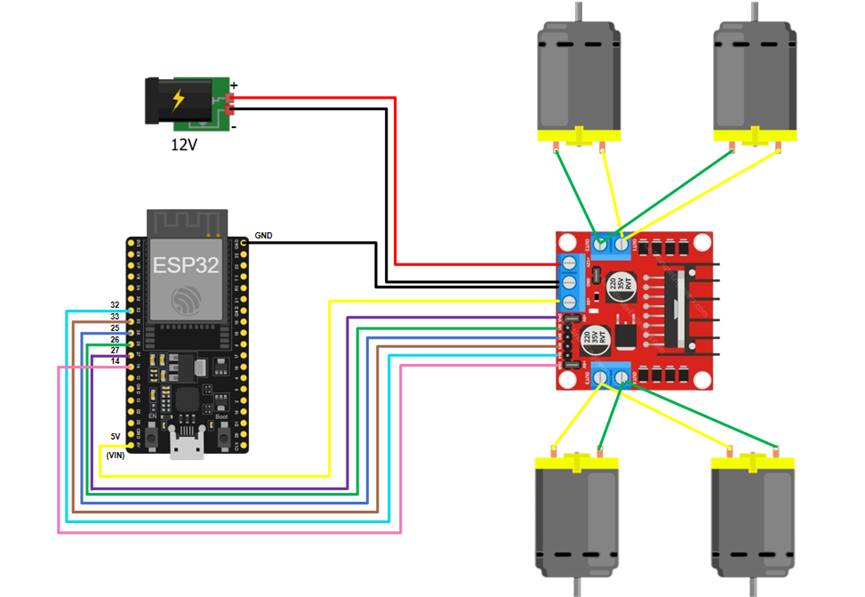

ESP32 Bluetooth Car với FreeRTOS
📌 Giới thiệu

Dự án này điều khiển xe 2 động cơ (dùng driver L298N) thông qua Bluetooth với ESP32.
Chương trình sử dụng FreeRTOS để chạy song song nhiều tác vụ:

Nhận lệnh từ Bluetooth.

Nhận lệnh từ Serial Monitor.

Điều khiển motor (task ưu tiên cao).

Hiển thị trạng thái hệ thống định kỳ.

Xe có thể tiến, lùi, rẽ trái, rẽ phải, dừng lại và thay đổi tốc độ bằng phím bấm.

